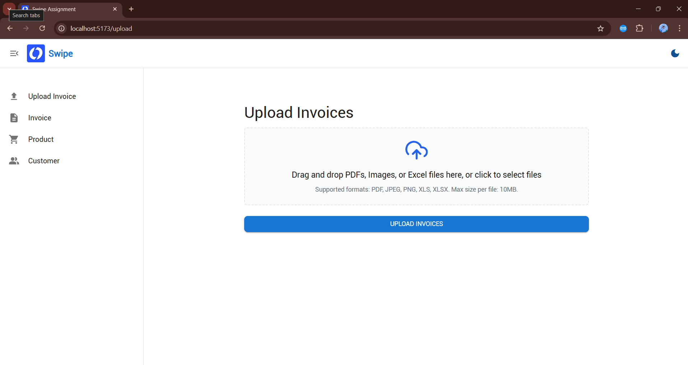
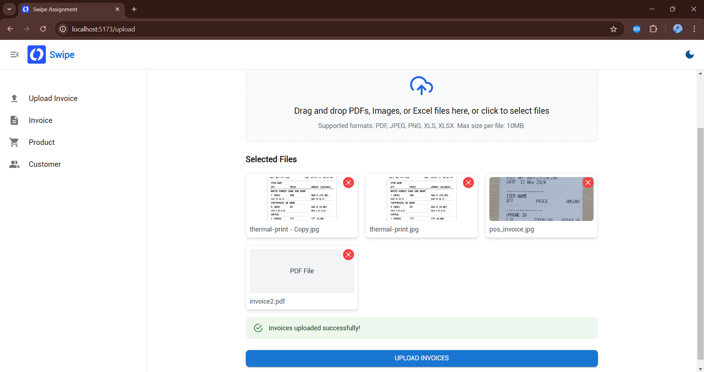
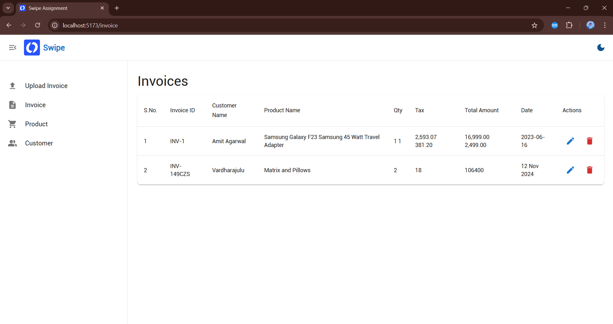
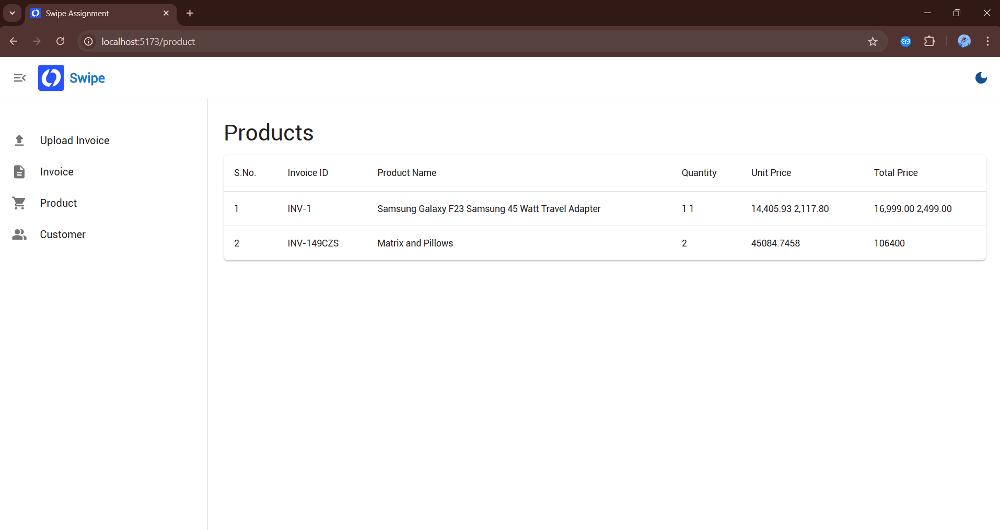
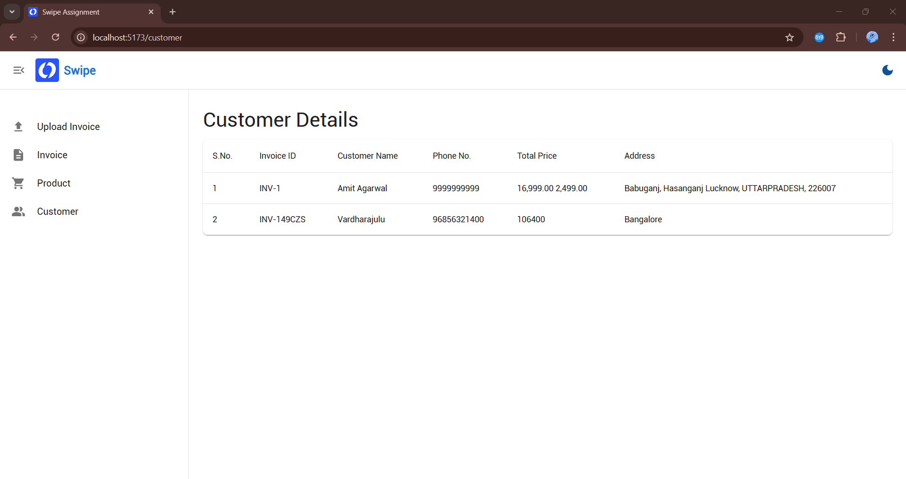
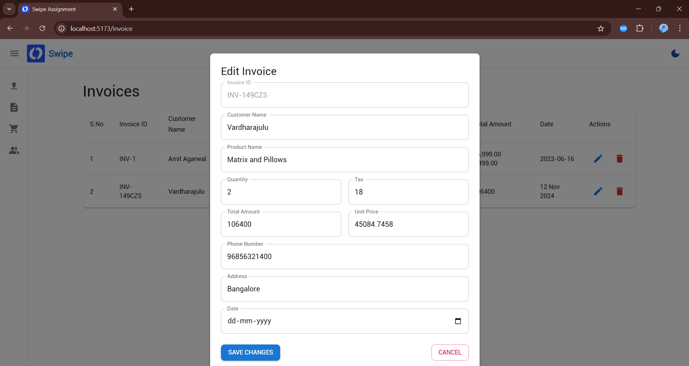

# Swipe Assignment
Project Video Link:- https://www.youtube.com/watch?v=nK5Xig9yM64&t=36s&ab_channel=RitikKumar
## Table of Contents

1. [Project Overview](#project-overview)
2. [Screenshots](#screenshots)
3. [Features](#features)
4. [Technologies Used](#technologies-used)
5. [Project Structure](#project-structure)
6. [Setup Instructions](#setup-instructions)
    - [1. Document Processing (FastAPI)](#1-document-processing-fastapi)
    - [2. Backend Service (Node.js)](#2-backend-service-nodejs)
    - [3. Frontend Service (React.js)](#3-frontend-service-reactjs)
7. [Usage](#usage)
8. [State Management](#state-management)
9. [Editing and Deleting Invoices](#editing-and-deleting-invoices)
10. [Contact](#contact)

---

## Project Overview

**Swipe Assignment** is a comprehensive application designed to facilitate the uploading and processing of various document types, including PDFs, images, and Excel files. The system extracts detailed information from invoices using Python's Unstructured library and processes this data through the Gemini LLM to generate structured invoice details. The frontend is built with React.js, the backend with Node.js, and invoice processing is handled by FastAPI, ensuring a seamless and efficient workflow.

---
## Screenshots

1. **Dashboard Layout:**

    

2. **Upload Invoices:**

    

3. **Invoices Tab:**

    

4. **Product Tab:**

    
   
5. **Customer Tab:**

    
   
5. **Edit Invoice Details:**

    


## Features

- **Multiple File Uploads:** Upload PDFs, images, and Excel files simultaneously with drag-and-drop or traditional file selection.
- **Invoice Processing:** Extract detailed invoice information using the Unstructured library and Gemini LLM.
- **Global State Management:** Utilize Redux Toolkit and Redux Persist to maintain state across the application.
- **Edit and Delete Functionality:** Modify or remove invoice entries, with changes reflected in localStorage.
- **Responsive UI:** User-friendly interface built with React.js and Material-UI.
- **Real-time Feedback:** Upload progress indicators.
- **Error Handling:** Comprehensive error messages for failed uploads or processing issues.

---

## Technologies Used

- **Frontend:**
  - React.js
  - Redux Toolkit
  - Redux Persist
  - Material-UI (MUI)
  - React Hook Form
  - React Dropzone
  - Axios
  - React Icons

- **Backend:**
  - Node.js
  - Express.js
  - Multer (for file uploads)
  - Cors

- **Invoice Processing:**
  - FastAPI
  - Python Unstructured Library
  - Gemini LLM

- **Others:**
  - Axios for HTTP requests
  - react-hot-toast for notifications


## Setup Instructions

Follow the steps below to set up and run the project on your local machine.

### 1. Document Processing (FastAPI)

**Location:** `documentProcessingModel/`

#### a. Create and Activate Virtual Environment

1. **Navigate to the Document Processing Directory:**

    ```bash
    cd documentProcessingModel
    ```
2. **Create a .env File:**
   ```bash  
    UPLOAD_DIR=uploads
    OCR_AGENT=pytesseract
    GEMINI_API_KEY=Gemini-Key
    GEMINI_API_ENDPOINT=https://api.gemini.example.com/v1/process
   ```
4. **Create a Virtual Environment:**

    ```bash
    python -m venv myenv
    ```

5. **Activate the Virtual Environment:**

    - **Windows:**

        ```bash
        myenv\Scripts\activate
        ```

    - **Unix or MacOS:**

        ```bash
        source myenv/bin/activate
        ```

#### b. Install Dependencies

1. **Install Required Python Packages:**

    Ensure that the `requirements.txt` file is present. Install the necessary Python packages:

    ```bash
    pip install -r requirements.txt
    ```

#### c. Run the FastAPI Server

1. **Start the FastAPI Server:**

    ```bash
    uvicorn main:app --host 127.0.0.1 --port 8000
    ```

    The server will start at [http://127.0.0.1:8000](http://127.0.0.1:8000).

---

### 2. Backend Service (Node.js)

**Location:** `backend/`

#### a. Install Dependencies

1. **Navigate to the Backend Directory:**

    ```bash
    cd backend
    ```

2. **Install Node.js Packages:**

    ```bash
    npm install
    ```
3. **Create a .env file:**
    ``` bash
    PORT=8080
    ```
#### b. Start the Backend Server

1. **Run the Backend Server:**

    ```bash
    npm start
    ```

    The backend server will run on [http://localhost:8080](http://localhost:8080) or the port specified in your environment variables.

---

### 3. Frontend Service (React.js)

**Location:** `frontend/swipe-assignment/`

#### a. Install Dependencies

1. **Navigate to the Frontend Directory:**

    ```bash
    cd frontend/swipe-assignment
    ```

2. **Install Node.js Packages:**

    ```bash
    npm install
    ```

#### b. Start the Frontend Server

1. **Run the Frontend Server:**

    ```bash
    npm run dev
    ```

    The frontend application will be available at [http://localhost:5173](http://localhost:5173) or the port specified in your configuration.

---

## Usage

1. **Access the Application:**
   - Open your browser and navigate to [http://localhost:5173](http://localhost:5173).

2. **Upload Invoices:**
   - Navigate to the **Upload Invoices** page.
   - Drag and drop multiple files (PDFs, images, Excel files) into the designated area or click to select files.
   - Review the selected files. You can remove any file before uploading.
   - Click on **Upload Invoices** to initiate the upload process.
   - Upon successful upload, the extracted invoice details will be stored globally and displayed in the **Invoices** tab.

3. **View Invoices:**
   - Navigate to the **Invoices** page to view all uploaded invoices.
   - The data is fetched from the global Redux state, allowing access across different components.

4. **Edit and Delete Invoices:**
   - In the **Invoices** page, you can edit or delete any invoice entry.
   - Changes are reflected in the localStorage, maintaining state across sessions.

---

## State Management

- **Redux Toolkit:** Utilized for global state management, enabling consistent state across the application.
- **Redux Persist:** Ensures that the state is persisted in the localStorage, maintaining data across page reloads and browser sessions.

---

## Editing and Deleting Invoices

- **Edit Functionality:**
  - Allows modification of invoice details directly from the **Invoices** page.
  - Updates are saved in the global state and reflected in the UI.

- **Delete Functionality:**
  - Enables removal of invoices from the global state.
  - Changes are also updated in the localStorage to maintain persistence.

---


---
## Contact

For any questions, suggestions, or feedback, please contact:

- **LinkedIn:** [Ritik Kumar](https://www.linkedin.com/in/ritik-kumar-9795a8227/)
- **Email:** [ritikrog90@gmail.com](mailto:ritikrog90@gmail.com)
- **GitHub:** [RITIKGITHUB18](https://github.com/RITIKGITHUB18)
---

By following this comprehensive README, you should be able to set up, run, and understand the Swipe Assignment project effectively. Ensure that all dependencies are correctly installed and that the services are running as expected. If you encounter any issues, reach out through the provided contact channels.


